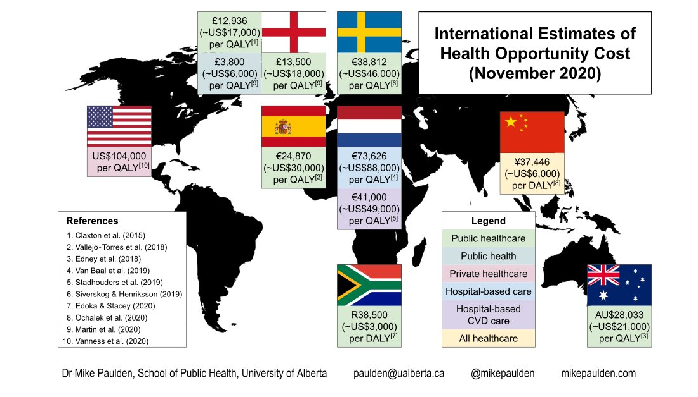
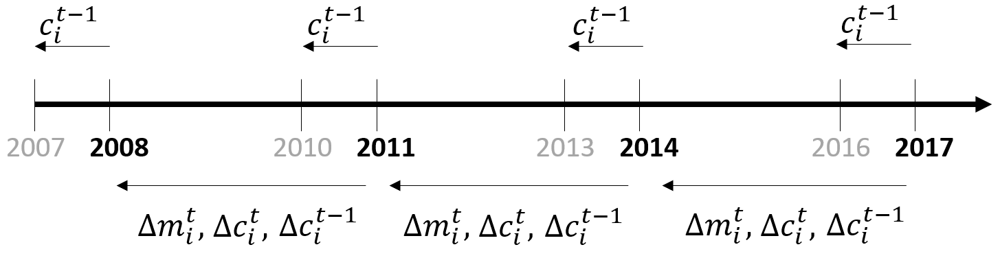

```{r setup, include=FALSE}
knitr::opts_chunk$set(echo = F)

# Packages for markdown
library("papaja")
library("worcs")
library("tidyverse")
library(bannerCommenter)
library(dplyr)
library(gridExtra)
library(ggplot2)
library(RColorBrewer)
library(grid)
library(patchwork)
# Packages for maps and spatial data
library(rgdal)
library(spdep)
library(rgeos)
library(maptools)
library(sf)
# Packges for Panel data and output
library(ggplot2)
library(viridis)
library(stargazer)
library(plm)
library(lmtest)
library(scales)

# We recommend that you prepare your raw data for analysis in 'prepare_data.R',
# and end that file with either open_data(yourdata), or closed_data(yourdata).
# Then, uncomment the line below to load the original or synthetic data
# (whichever is available), to allow anyone to reproduce your code:

load_data()

#load_data()
#load("./Data_ready/clean_data.rda")
#load("./Data_ready/regression_state_level.rda")


#str(data)
data <- data %>%
  mutate(year = as.factor(year))

data_wide_reg <- data
data_long_states <- data
data_wide_fig <- data
r_refs("r-references.bib")

```


# Introduction

## Motivation
- Estimates of cost-effectiveness thresholds (or value of health in general) may help resource allocation decisions both within and outside the health care sector)

$$\frac{\Delta C}{\Delta Q} < v_Q | k_Q$$

- Such estiamtes can be derived based on the opportunity costs (i.e. marginal return) of health spending (Brouwer et al., 2019)
- Objective is to do just that for Germany, focusing on CVD as number one cause of death and health spending (Dornquast et al., 2016)

## Literature on health opportunity costs

{#id .class width=100% height=100%}
While Germany currently is not using CEA, information on the opportunity costs of health care spending is still relevant

# Methods

## Outline
- Following approach by van Baal et al. (2019) using German data
- Regressing mortality on spending and conducting life table calculations
- First difference model on state aggregate level using variation across age and gender groups

## Data sources

- Hospital spending data for CVD were obtained by accessing the German DRG data

- Age- and gender-group specific average hospital spending per state could be extracted for the years 2007 to 2017

- Age- and gender-group specific CVD mortality data was extracted from the German mortality statistics for all 16 German states 

- Life tables from the Federal Statistical Office provided information on the remaining life expectancy across age- and gender-groups. 

- To approximate health related quality of life across age-groups, EQ-5D index population norms for Germany were extracted from Janssen et al. (2014)

## CVD mortality and hospital spending: 2007 vs 2017

```{r,  fig.cap = "Change in CVD mortality and hospital spending between 2007 and 2017", message = FALSE, echo=FALSE,results='hide',fig.keep='all', fig.align="center"} 
# Suppress info on generating figures


#====================================================================================================
#                                      CVD figure
#====================================================================================================


# CVD
mort_100k_2007_CVD <- data %>%
  filter(year =="2007" | year == "2017") %>% 
  group_by(agegroup, gender, year) %>%
  summarise(CVD_deaths = sum(CVD_deaths), pop = sum(population)) %>% 
  mutate(CVD_mortality = CVD_deaths/pop)


m2 <- mort_100k_2007_CVD %>% 
  filter((agegroup != "<1" &
            agegroup != "1-14" &
            agegroup != "15-19" &
            agegroup != "20-24" &
            agegroup != "25-29" &
            agegroup != "30-34" &
            agegroup != "35-39" &
            agegroup != "40-44" &
            agegroup != "45-49" &
            agegroup != "50-54" &
            agegroup != "55-59")) %>% 
  ggplot(aes(agegroup, CVD_mortality, color = year, shape = year)) +
  geom_point(size = 3) + facet_grid(.~gender) + 
  theme(axis.text.x = element_text(angle = 90, hjust = 1), axis.title = element_blank()) +
  ggtitle("CVD mortality rate") +theme(legend.position = "none")+
  scale_color_manual(values=c("red4", "dodgerblue4"))+
  theme(plot.title = element_text(size = 16, hjust = 0.5))+
  scale_shape_manual(values=c(2, 8))


#====================================================================================================
#                                       Cost figure
#====================================================================================================


# CVD
cost_100k_2007_CVD <- data %>%
  filter(year =="2007" | year == "2017") %>% 
  group_by(agegroup, gender, year) %>%
  summarise(CVD_costs_pc = sum(CVD_costs_sum)/sum(population))

            
c2 <- cost_100k_2007_CVD %>% 
  filter((agegroup != "<1" &
            agegroup != "1-14" &
            agegroup != "15-19" &
            agegroup != "20-24" &
            agegroup != "25-29" &
            agegroup != "30-34" &
            agegroup != "35-39" &
            agegroup != "40-44" &
            agegroup != "45-49" &
            agegroup != "50-54" &
            agegroup != "55-59")) %>% 
  ggplot(aes(agegroup, CVD_costs_pc, color = year, shape = year)) +
  geom_point(size = 3) + facet_grid(.~gender) + 
  theme(axis.text.x = element_text(angle = 90, hjust = 1), axis.title = element_blank()) +
  ggtitle("CVD spending per capita in Euro") +theme(legend.position = "none")+
  scale_color_manual(values=c("red4", "dodgerblue4"))+
  ylim(0,1150) +
  theme(plot.title = element_text(size = 16, hjust = 0.5))+
  scale_shape_manual(values=c(2, 8))

CVD_fig <- m2 + c2 +
  plot_layout(guides = "collect") &
  theme(legend.position = "top",
        legend.background = element_rect(fill="white", colour = "white"),
        legend.title=element_blank(), axis.title = element_blank()
        )

CVD_fig


```

## Variation in CVD mortality changes: 2007 vs 2017

```{r, fig.cap = "Regional variation in CVD mortality and cost changes from 2007 to 2017. Grey indicates mortality increases or cost decreases. Male aged 90+ not comparable.", echo=FALSE,results='hide',fig.keep='all', fig.align="center", fig.asp= 0.7}


#====================================================================================================
#                                       Heatmap differences regions
#====================================================================================================


#====================================================================================================
#                                       CVD mortality change
#====================================================================================================


# Reshape data to wide format

data_wide <- data %>% 
  subset(select = c(year, region, gender,agegroup, CVD_mort_100k, CVD_costs_100k))

data_wide <- data_wide %>%
  pivot_wider(names_from = year, values_from = CVD_mort_100k, names_prefix = "y")

data_wide <- data_wide %>%
  subset(select = c(region, gender,agegroup, y2007, y2017)) %>%
  filter(!is.na(y2007) | !is.na(y2017))


data_wide_2007 <- data_wide %>%
  subset(select = -c(y2017)) %>% 
  filter(!is.na(y2007))
data_wide_2017 <- data_wide %>%
  subset(select = -c(y2007)) %>% 
  filter(!is.na(y2017))

# Merge
data_wide <- left_join(data_wide_2007, data_wide_2017, by = c("region", "gender", "agegroup"))

# Generate change in mortality per 100k from 2007 to 2017 per age, gender, region
data_wide <- data_wide %>%
  mutate(change_mort = y2017-y2007)

# Generate change in mortality in % (downside 0 observations are dropped)
data_wide <- data_wide %>%
  mutate(change_mort_percent = -1*((1-(y2017/y2007))*100))


#====================================================================================================
#                                       Male
#====================================================================================================


str(data_wide)

# If all age groups should be included

# data_wide %>%
#   ggplot(aes(x = agegroup, y = region)) +
#   geom_tile(aes(fill = change_mort_percent)) +
#   scale_fill_gradient2(limits=c(-100, 100), breaks=seq(-100,100,by=25)) 

# Just include older age groups where differences are larger
data_wide_m_old <- data_wide %>% 
  filter(gender == "Male") %>%
  filter(agegroup =="60-64" | agegroup == "65-69" | agegroup =="70-74" | agegroup =="75-79" | agegroup =="80-84" | agegroup =="85-89" | agegroup =="90+")

# Graph male
mort_reg_m <- data_wide_m_old %>%
  ggplot(aes(x = agegroup, y = factor(region, level = c("TH", "ST", "SN", "SL", "SH", "RP", "NW", "NI", "MV", "HH", "HE", "HB", "BY", "BW", "BE", "BB")))) +
  geom_tile(aes(fill = change_mort)) +
  scale_fill_viridis_c(limits=c(-3100, 100), breaks=seq(-3000,0,by=1000)) +
  theme(axis.title.x=element_blank()) +
  theme(legend.position = "bottom") + 
  theme(legend.key.size = unit(0.5, "cm"), legend.text = element_text(size = 8)) +
  labs(fill = "Mortality/100k") +
  ggtitle("Male")+
  xlab("")+
  ylab("")+
  theme(plot.title = element_text(hjust = 0.5))


#====================================================================================================
#                                      Female
#====================================================================================================

# Just include older age groups where differences are larger, censor data at -3000 for figure
data_wide_f_old <- data_wide %>% 
  filter(gender == "Female") %>%
  filter(agegroup =="60-64" | agegroup == "65-69" | agegroup =="70-74" | agegroup =="75-79" | agegroup =="80-84" | agegroup =="85-89" | agegroup =="90+") %>% 
  mutate(change_mort = replace(change_mort, change_mort < -3000, -3000))

# Graph female
mort_reg_f <- data_wide_f_old %>%
  ggplot(aes(x = agegroup, y = factor(region, level = c("TH", "ST", "SN", "SL", "SH", "RP", "NW", "NI", "MV", "HH", "HE", "HB", "BY", "BW", "BE", "BB")))) +
  geom_tile(aes(fill = change_mort)) + 
  scale_fill_viridis_c(limits=c(-3100, 100), breaks=seq(-3000,0,by=1000)) +
  theme(axis.title.y=element_blank(),
        axis.text.y=element_blank(),
        axis.ticks.y=element_blank()) +
  theme(axis.title.x=element_blank()) +
  theme(legend.position = "bottom") + 
  theme(legend.key.size = unit(0.5, "cm"), legend.text = element_text(size = 8))+
  labs(fill = "Mortality/100k") +
  ggtitle("Female") +
  xlab("")+
  theme(plot.title = element_text(hjust = 0.5))

#====================================================================================================
#                                       CVD costs change
#====================================================================================================


# Reshape data to wide format

data_wide <- data %>% 
  subset(select = c(year, region, gender,agegroup, CVD_costs_100k))

data_wide <- data_wide %>%
  pivot_wider(names_from = year, values_from = CVD_costs_100k, names_prefix = "y")

data_wide <- data_wide %>%
  subset(select = c(region, gender,agegroup, y2007, y2017)) %>%
  filter(!is.na(y2007) | !is.na(y2017))


# data_wide_2007 <- data_wide %>%
#   subset(select = -c(y2017)) %>% 
#   filter(!is.na(y2007))
# data_wide_2017 <- data_wide %>%
#   subset(select = -c(y2007)) %>% 
#   filter(!is.na(y2017))
# 
# # Merge
# data_wide <- left_join(data_wide_2007, data_wide_2017, by = c("region", "gender", "agegroup"))

# Generate change in costs per 100k from 2007 to 2017 per age, gender, region
data_wide <- data_wide %>%
  mutate(change_costs = y2017-y2007)

# Generate change in costs in % (downside 0 observations are dropped)
data_wide <- data_wide %>%
  mutate(change_costs_percent = -1*((1-(y2017/y2007))*100))


#====================================================================================================
#                                       Male
#====================================================================================================

# If all age groups should be included

# data_wide %>%
#   ggplot(aes(x = agegroup, y = region)) +
#   geom_tile(aes(fill = change_mort_percent)) +
#   scale_fill_gradient2(limits=c(-100, 100), breaks=seq(-100,100,by=25)) 

# Just include older age groups where differences are larger
data_wide_m_old <- data_wide %>% 
  filter(gender == "Male") %>%
  filter(agegroup =="60-64" | agegroup == "65-69" | agegroup =="70-74" | agegroup =="75-79" | agegroup =="80-84" | agegroup =="85-89" | agegroup =="90+" )

# Graph male
costs_reg_m <- data_wide_m_old %>%
  ggplot(aes(x = agegroup, y = factor(region, level = c("TH", "ST", "SN", "SL", "SH", "RP", "NW", "NI", "MV", "HH", "HE", "HB", "BY", "BW", "BE", "BB")))) +
  geom_tile(aes(fill = change_costs)) +
  scale_fill_viridis(option = "magma", direction = -1, limits=c(0, 43000000)) +
  theme(legend.position = "bottom") + 
  theme(legend.key.size = unit(0.5, "cm"), legend.text = element_text(size = 8)) +
  labs(fill = "Spending/100k") +
  ggtitle("Male") +
  xlab("")+
  ylab("")+
  theme(plot.title = element_text(hjust = 0.5))

#  scale_fill_viridis(option = "magma", direction = -1, limits=c(0, 2600), breaks=seq(0,2000,by=1000)) +

#====================================================================================================
#                                      Female
#====================================================================================================

# Just include older age groups where differences are larger, censor data at -3000 for figure
data_wide_f_old <- data_wide %>% 
  filter(gender == "Female") %>%
  filter(agegroup =="60-64" | agegroup == "65-69" | agegroup =="70-74" | agegroup =="75-79" | agegroup =="80-84" | agegroup =="85-89" | agegroup =="90+") #%>% 
  #mutate(change_costs = replace(change_costs, change_costs < -3000, -3000))

# Graph female
costs_reg_f <- data_wide_f_old %>%
  ggplot(aes(x = agegroup, y = factor(region, level = c("TH", "ST", "SN", "SL", "SH", "RP", "NW", "NI", "MV", "HH", "HE", "HB", "BY", "BW", "BE", "BB")))) +
  geom_tile(aes(fill = change_costs)) + 
  scale_fill_viridis(option = "magma", direction = -1, limits=c(0, 43000000)) +
  theme(axis.title.y=element_blank(),
        axis.text.y=element_blank(),
        axis.ticks.y=element_blank()) +
  theme(legend.position = "bottom") + 
  theme(legend.key.size = unit(0.5, "cm"), legend.text = element_text(size = 8))+
  labs(fill = "Spending/100k") +
  ggtitle("Female") +
  xlab("") +
  theme(plot.title = element_text(hjust = 0.5))
  


# Combine graph

mort_reg_m + mort_reg_f +
  plot_layout(guides = "collect") & theme(legend.position = "right")


```

## Variation in CVD hospital spending: 2007 vs 2017

```{r, fig.cap = "Regional variation in CVD cost changes from 2007 to 2017. Grey indicates mortality increases or cost decreases. Male aged 90+ not comparable.", echo=FALSE,results='hide',fig.keep='all', fig.align="center", fig.asp= 0.7}
costs_reg_m + costs_reg_f +
  plot_layout(guides = "collect") & theme(legend.position = "right")
```

## Regression model (1)

**First difference specification:**
$$\Delta m_i = \mu+ \alpha \Delta c_i ^t + \beta \Delta c_i ^{t-1} + \eta \Delta  c_i ^{t2} + \gamma_t + \tau_i + \epsilon_i$$
$i$: Observation on Period X Agegroup X Gender X State level

$\Delta m_i$: FD of CVD mortality

$\Delta c_i ^t$: FD of CVD spending

$\Delta c_i ^{t-1}$ FD of lag CVD spending

$\Delta  c_i ^{t2}$ Squared FD of CVD mortality

$\mu$, $\gamma_t$, $\tau_i$, $\eta_i$: intercept, year, gender, region dummies

- Using $\alpha, \beta, \eta$ to estimate the effect of additional spending at the margin 


## Temporal variation in CVD mortality across states

```{r, echo=FALSE, results='hide', fig.keep='all', message = FALSE, warning = FALSE, fig.align="center", fig.asp= 0.7}

# Age collapse

library(ggpubr)


#====================================================================================================
#                                       Conditioning on 60+
#====================================================================================================


# Drop below 60, low variation in agegroups before (similar to van Baal et al., 2018), lot of noise
data <- data_agecollapse %>%
  filter(agegroup =="6" | agegroup == "7" | agegroup =="8" | agegroup =="9") %>% 
  filter(!(agegroup == "9" & gender =="Male"))

#====================================================================================================
#                                       Plotting first differences
#====================================================================================================


# revert to data frame for plotting
data <- as.data.frame(data)


# Generate histogramms and scatterplots for first differences
hist1 <- data %>% 
  filter(d_CVD_mort_100k !=0) %>%
  ggplot(data = data, mapping = aes(x = d_CVD_mort_100k)) +
  geom_histogram() +
  xlim(-200, 200) +
  stat_central_tendency(type = "median", linetype = "dashed")

hist2 <- data %>% 
  filter(d_CVD_costs_100k !=0) %>%
  ggplot(data = data, mapping = aes(x = d_CVD_costs_100k)) +
  geom_histogram() +
  xlim(-5e+06,5e+06) +
  stat_central_tendency(type = "median", linetype = "dashed")

hist3 <- data %>% 
  filter(d_log_CVD_mort_100k != is.na) %>%
  ggplot(data = data, mapping = aes(x = d_log_CVD_mort_100k)) +
  geom_histogram() +
  stat_central_tendency(type = "median", linetype = "dashed")

hist4 <- data %>% 
  filter(d_log_CVD_costs_100k !=0) %>%
  ggplot(data = data, mapping = aes(x = d_log_CVD_costs_100k)) +
  geom_histogram() +
  stat_central_tendency(type = "median", linetype = "dashed")

scatter1 <- data %>%
  ggplot(data = data, mapping = aes(x = d_CVD_costs_100k, y = d_CVD_mort_100k)) +
  geom_point() +
  geom_smooth(method = "lm")

scatter2 <- data %>%
  ggplot(data = data, mapping = aes(x = d_log_CVD_costs_100k, y = d_log_CVD_mort_100k)) +
  geom_point() +
  geom_smooth(method = "lm")


# Combine plot
#grid.arrange(hist1, hist3, hist2, hist4, scatter1, scatter2)


#====================================================================================================
#                                       Plotting temporal variation in mortality
#====================================================================================================


#====================================================================================================
#                                       Rescaling mortality to 100% - lags
#====================================================================================================


#class(data)

data <- pdata.frame(data, index = c("ID", "year"))

# Graph with base 2007
data <- data %>%
  mutate(CVD_mort_100k_base2007 = 0)

data <- data %>% 
  mutate(CVD_mort_100k_base2007 = if_else(year == 2007, 1, CVD_mort_100k_base2007),
         CVD_mort_100k_base2007 = if_else(year == 2008, CVD_mort_100k/(lag(CVD_mort_100k)), CVD_mort_100k_base2007),
         CVD_mort_100k_base2007 = if_else(year == 2009, CVD_mort_100k/(lag(CVD_mort_100k, n = 2)), CVD_mort_100k_base2007),
         CVD_mort_100k_base2007 = if_else(year == 2010, CVD_mort_100k/(lag(CVD_mort_100k, n = 3)), CVD_mort_100k_base2007),
         CVD_mort_100k_base2007 = if_else(year == 2011, CVD_mort_100k/(lag(CVD_mort_100k, n = 4)), CVD_mort_100k_base2007),
         CVD_mort_100k_base2007 = if_else(year == 2012, CVD_mort_100k/(lag(CVD_mort_100k, n = 5)), CVD_mort_100k_base2007),
         CVD_mort_100k_base2007 = if_else(year == 2013, CVD_mort_100k/(lag(CVD_mort_100k, n = 6)), CVD_mort_100k_base2007),
         CVD_mort_100k_base2007 = if_else(year == 2014, CVD_mort_100k/(lag(CVD_mort_100k, n = 7)), CVD_mort_100k_base2007),
         CVD_mort_100k_base2007 = if_else(year == 2015, CVD_mort_100k/(lag(CVD_mort_100k, n = 8)), CVD_mort_100k_base2007),
         CVD_mort_100k_base2007 = if_else(year == 2016, CVD_mort_100k/(lag(CVD_mort_100k, n = 9)), CVD_mort_100k_base2007),
         CVD_mort_100k_base2007 = if_else(year == 2017, CVD_mort_100k/(lag(CVD_mort_100k, n = 10)), CVD_mort_100k_base2007),
         )

# Male
line_plot_base2007_male <- data %>%
  filter(gender == "Male") %>% 
  ggplot(aes(x = year, y = CVD_mort_100k_base2007, group = agegroup)) +
  geom_line(aes(colour = agegroup)) +
  facet_wrap(~ region, nrow = 4) +
  theme(axis.text.x = element_text(angle = 90, vjust = 0.5, hjust=1)) +
  labs(x = "") +
  labs(y = "%-Difference in CVD mortality compared to 2007") +
  geom_hline(yintercept = 1)

#line_plot_base2007_male

# Female
line_plot_base2007_female <- data %>%
  filter(gender == "Female") %>% 
  ggplot(aes(x = year, y = CVD_mort_100k_base2007, group = agegroup)) +
  geom_line(aes(colour = agegroup)) +
  scale_fill_viridis_c() +
  facet_wrap(~ region, nrow = 4) +
  theme(axis.text.x = element_text(angle = 90, vjust = 0.5, hjust=1))+
  labs(x = "") +
  labs(y = "%-Difference in CVD mortality compared to 2007") +
  geom_hline(yintercept = 1)

line_plot_base2007_female


# Graph with percentage change compared to previous year
data <- data %>%
  mutate(CVD_mort_100k_percent = 0)

data <- data %>% 
  mutate(CVD_mort_100k_percent = if_else(year == 2007, 0, CVD_mort_100k_percent),
         CVD_mort_100k_percent = if_else(year == 2008, (CVD_mort_100k/(lag(CVD_mort_100k)))-1, CVD_mort_100k_percent),
         CVD_mort_100k_percent = if_else(year == 2009, (CVD_mort_100k/(lag(CVD_mort_100k)))-1, CVD_mort_100k_percent),
         CVD_mort_100k_percent = if_else(year == 2010, (CVD_mort_100k/(lag(CVD_mort_100k)))-1, CVD_mort_100k_percent),
         CVD_mort_100k_percent = if_else(year == 2011, (CVD_mort_100k/(lag(CVD_mort_100k)))-1, CVD_mort_100k_percent),
         CVD_mort_100k_percent = if_else(year == 2012, (CVD_mort_100k/(lag(CVD_mort_100k)))-1, CVD_mort_100k_percent),
         CVD_mort_100k_percent = if_else(year == 2013, (CVD_mort_100k/(lag(CVD_mort_100k)))-1, CVD_mort_100k_percent),
         CVD_mort_100k_percent = if_else(year == 2014, (CVD_mort_100k/(lag(CVD_mort_100k)))-1, CVD_mort_100k_percent),
         CVD_mort_100k_percent = if_else(year == 2015, (CVD_mort_100k/(lag(CVD_mort_100k)))-1, CVD_mort_100k_percent),
         CVD_mort_100k_percent = if_else(year == 2016, (CVD_mort_100k/(lag(CVD_mort_100k)))-1, CVD_mort_100k_percent),
         CVD_mort_100k_percent = if_else(year == 2017, (CVD_mort_100k/(lag(CVD_mort_100k)))-1, CVD_mort_100k_percent),
  )

# Male
line_plot_percent_male <- data %>%
  filter(gender == "Male") %>% 
  ggplot(aes(x = year, y = CVD_mort_100k_percent, group = agegroup)) +
  geom_line(aes(colour = agegroup)) +
  facet_wrap(~ region, nrow = 4) +
  theme(axis.text.x = element_text(angle = 90, vjust = 0.5, hjust=1))+
  labs(x = "") +
  labs(y = "%-Difference compared to previous year") +
  geom_hline(yintercept = 0)

#line_plot_percent_male

# Female
line_plot_percent_female_mort <- data %>%
  filter(gender == "Female") %>% 
  ggplot(aes(x = year, y = CVD_mort_100k_percent, group = agegroup)) +
  geom_line(aes(colour = agegroup)) +
  facet_wrap(~ region, nrow = 4) +
  theme(axis.text.x = element_text(angle = 90, vjust = 0.5, hjust=1))+
  labs(x = "") +
  labs(y = "%-Difference compared to previous year") +
  geom_hline(yintercept = 0)


#====================================================================================================
#                                       Plotting temporal variation in spending
#====================================================================================================


#====================================================================================================
#                                       Rescaling spending to 100% - lags
#====================================================================================================


# Graph with base 2007
data <- data %>%
  mutate(CVD_costs_100k_base2007 = 0)

data <- data %>% 
  mutate(CVD_costs_100k_base2007 = if_else(year == 2007, 1, CVD_costs_100k_base2007),
         CVD_costs_100k_base2007 = if_else(year == 2008, CVD_costs_100k/(lag(CVD_costs_100k)), CVD_costs_100k_base2007),
         CVD_costs_100k_base2007 = if_else(year == 2009, CVD_costs_100k/(lag(CVD_costs_100k, n = 2)), CVD_costs_100k_base2007),
         CVD_costs_100k_base2007 = if_else(year == 2010, CVD_costs_100k/(lag(CVD_costs_100k, n = 3)), CVD_costs_100k_base2007),
         CVD_costs_100k_base2007 = if_else(year == 2011, CVD_costs_100k/(lag(CVD_costs_100k, n = 4)), CVD_costs_100k_base2007),
         CVD_costs_100k_base2007 = if_else(year == 2012, CVD_costs_100k/(lag(CVD_costs_100k, n = 5)), CVD_costs_100k_base2007),
         CVD_costs_100k_base2007 = if_else(year == 2013, CVD_costs_100k/(lag(CVD_costs_100k, n = 6)), CVD_costs_100k_base2007),
         CVD_costs_100k_base2007 = if_else(year == 2014, CVD_costs_100k/(lag(CVD_costs_100k, n = 7)), CVD_costs_100k_base2007),
         CVD_costs_100k_base2007 = if_else(year == 2015, CVD_costs_100k/(lag(CVD_costs_100k, n = 8)), CVD_costs_100k_base2007),
         CVD_costs_100k_base2007 = if_else(year == 2016, CVD_costs_100k/(lag(CVD_costs_100k, n = 9)), CVD_costs_100k_base2007),
         CVD_costs_100k_base2007 = if_else(year == 2017, CVD_costs_100k/(lag(CVD_costs_100k, n = 10)), CVD_costs_100k_base2007),
  )

# Male
line_plot_base2007_male <- data %>%
  filter(gender == "Male") %>% 
  ggplot(aes(x = year, y = CVD_costs_100k_base2007, group = agegroup)) +
  geom_line(aes(colour = agegroup)) +
  facet_wrap(~ region, nrow = 4) +
  theme(axis.text.x = element_text(angle = 90, vjust = 0.5, hjust=1)) +
  labs(x = "") +
  labs(y = "%-Difference in CVD costsality compared to 2007") +
  geom_hline(yintercept = 1)

#line_plot_base2007_male

# Female
line_plot_base2007_female <- data %>%
  filter(gender == "Female") %>% 
  ggplot(aes(x = year, y = CVD_costs_100k_base2007, group = agegroup)) +
  geom_line(aes(colour = agegroup)) +
  facet_wrap(~ region, nrow = 4) +
  theme(axis.text.x = element_text(angle = 90, vjust = 0.5, hjust=1))+
  labs(x = "") +
  labs(y = "%-Difference in CVD costsality compared to 2007") +
  geom_hline(yintercept = 1)

#line_plot_base2007_female


# Graph with percentage change compared to previous year
data <- data %>%
  mutate(CVD_costs_100k_percent = 0)

data <- data %>% 
  mutate(CVD_costs_100k_percent = if_else(year == 2007, 0, CVD_costs_100k_percent),
         CVD_costs_100k_percent = if_else(year == 2008, (CVD_costs_100k/(lag(CVD_costs_100k)))-1, CVD_costs_100k_percent),
         CVD_costs_100k_percent = if_else(year == 2009, (CVD_costs_100k/(lag(CVD_costs_100k)))-1, CVD_costs_100k_percent),
         CVD_costs_100k_percent = if_else(year == 2010, (CVD_costs_100k/(lag(CVD_costs_100k)))-1, CVD_costs_100k_percent),
         CVD_costs_100k_percent = if_else(year == 2011, (CVD_costs_100k/(lag(CVD_costs_100k)))-1, CVD_costs_100k_percent),
         CVD_costs_100k_percent = if_else(year == 2012, (CVD_costs_100k/(lag(CVD_costs_100k)))-1, CVD_costs_100k_percent),
         CVD_costs_100k_percent = if_else(year == 2013, (CVD_costs_100k/(lag(CVD_costs_100k)))-1, CVD_costs_100k_percent),
         CVD_costs_100k_percent = if_else(year == 2014, (CVD_costs_100k/(lag(CVD_costs_100k)))-1, CVD_costs_100k_percent),
         CVD_costs_100k_percent = if_else(year == 2015, (CVD_costs_100k/(lag(CVD_costs_100k)))-1, CVD_costs_100k_percent),
         CVD_costs_100k_percent = if_else(year == 2016, (CVD_costs_100k/(lag(CVD_costs_100k)))-1, CVD_costs_100k_percent),
         CVD_costs_100k_percent = if_else(year == 2017, (CVD_costs_100k/(lag(CVD_costs_100k)))-1, CVD_costs_100k_percent),
  )

# Male
line_plot_percent_male <- data %>%
  filter(gender == "Male") %>% 
  ggplot(aes(x = year, y = CVD_costs_100k_percent, group = agegroup)) +
  geom_line(aes(colour = agegroup)) +
  facet_wrap(~ region, nrow = 4) +
  theme(axis.text.x = element_text(angle = 90, vjust = 0.5, hjust=1))+
  labs(x = "") +
  labs(y = "%-Difference compared to previous year") +
  geom_hline(yintercept = 0)

#line_plot_percent_male

# Female
line_plot_percent_female <- data %>%
  filter(gender == "Female") %>% 
  ggplot(aes(x = year, y = CVD_costs_100k_percent, group = agegroup)) +
  geom_line(aes(colour = agegroup)) +
  facet_wrap(~ region, nrow = 4) +
  theme(axis.text.x = element_text(angle = 90, vjust = 0.5, hjust=1))+
  labs(x = "") +
  labs(y = "%-Difference compared to previous year") +
  geom_hline(yintercept = 0)

#line_plot_percent_female


```

## Temporal variation in CVD mortality across states

```{r, echo=FALSE, results='hide', fig.keep='all', message = FALSE, warning = FALSE, fig.align="center", fig.asp= 0.7}

line_plot_percent_female_mort


```


## First differences using all years and states

```{r, echo=FALSE, results='hide', fig.keep='all', message = FALSE, warning = FALSE, fig.align="center", fig.asp= 0.7}


#====================================================================================================
#                                       Conditioning on 60+
#====================================================================================================


# Drop below 60, low variation in agegroups before (similar to van Baal et al., 2018), lot of noise
data <- data_state %>% filter(agegroup =="60-64" | agegroup == "65-69" | agegroup =="70-74" | agegroup =="75-79" | agegroup =="80-84" | agegroup =="85-89" | agegroup =="90+" ) 

#====================================================================================================
#                                       Plotting first differences
#====================================================================================================


# revert to data frame for plotting
data <- as.data.frame(data)


# Generate histogramms and scatterplots for first differences
scatter1 <- data %>%
  ggplot(data = data, mapping = aes(x = d_CVD_costs_100k, y = d_CVD_mort_100k)) +
  geom_point(aes(colour = agegroup), size = 1) +
  geom_smooth(method = "lm")+
  xlim(-20000000, 25000000) +
  ylim(-3000, 2000)+
  labs(x = "Difference in CVD spending (per 100k) compared to previous period") +
  labs(y = "Difference in CVD mortality (per 100k) compared to previous period") +
  geom_hline(yintercept = 0) +
  geom_vline(xintercept = 0) +
  scale_fill_viridis_c()

scatter1
```

## First differences using four time periods

```{r, echo=FALSE, results='hide', fig.keep='all', message = FALSE, warning = FALSE, fig.align="center", fig.asp= 0.7}


#====================================================================================================
#                                       Conditioning on 60+
#====================================================================================================


# Drop below 60, low variation in agegroups before (similar to van Baal et al., 2018), lot of noise
data <- data_state_4pm %>% filter(agegroup =="60-64" | agegroup == "65-69" | agegroup =="70-74" | agegroup =="75-79" | agegroup =="80-84" | agegroup =="85-89" | agegroup =="90+" ) 

#====================================================================================================
#                                       Plotting first differences
#====================================================================================================


# revert to data frame for plotting
data <- as.data.frame(data)


# Generate scatterplots for first differences
scatter1 <- data %>%
  ggplot(data = data, mapping = aes(x = d_CVD_costs_100k, y = d_CVD_mort_100k)) +
  geom_point(aes(colour = agegroup),size = 1) +
  geom_smooth(method = "lm") +
  xlim(-20000000, 25000000)+
  ylim(-3000, 2000) +
  labs(x = "Difference in CVD spending (per 100k) compared to previous period") +
  labs(y = "Difference in CVD mortality (per 100k) compared to previous period") +
  geom_hline(yintercept = 0) +
  geom_vline(xintercept = 0)

scatter1
```


## Regression model (2)

{#id .class width=100% height=100%}

**Identifying assumption:** Time variant Variation in mortality trends that cannot be explained by period- region- and gender-specific time trends is caused by changes in medical spending.

**Blind spot and implied assumption:** Variation in outpatient spending is captured by FD and included dummies

## Estimating opportunity cost-based threshold 

**Life table calculations:**

{#id .class width=100% height=100%}
**ICER calculations using two scenarios:**


{#id .class width=40% height=40%}


# Results

```{r results ='hide', message = FALSE, echo = FALSE, warning = FALSE}


#====================================================================================================
#                                       Conditioning on 60+
#====================================================================================================


# Drop below 60, low variation in agegroups before (similar to van Baal et al., 2018), lot of noise
data <- data_state_4pm %>% filter(agegroup =="60-64" | agegroup == "65-69" | agegroup =="70-74" | agegroup =="75-79" | agegroup =="80-84" | agegroup =="85-89" | agegroup =="90+" ) 


#====================================================================================================
#                                       CVD models
#====================================================================================================

# Recode variables times 1000
data_log <- data
data <- data %>%
  mutate(d_CVD_costs_100k = d_CVD_costs_100k/1000000) %>% 
  mutate(d_lag_CVD_costs_100k = d_lag_CVD_costs_100k/1000000)

# Models
base_lag <- lm(d_CVD_mort_100k ~ d_CVD_costs_100k +  d_lag_CVD_costs_100k, data = data)
base_lag_sq <- lm(d_CVD_mort_100k ~ d_CVD_costs_100k +  d_lag_CVD_costs_100k + I(d_CVD_costs_100k^2) , data = data)
base_lag_sq_region_year <- lm(d_CVD_mort_100k ~ d_CVD_costs_100k +  d_lag_CVD_costs_100k + I(d_CVD_costs_100k^2) + region + year, data = data)
base_lag_sq_region_year_gender <- lm(d_CVD_mort_100k ~ d_CVD_costs_100k +  d_lag_CVD_costs_100k + I(d_CVD_costs_100k^2) + region + year + gender, data = data)
base_lag_sq_region_year_gender_agegroup <- lm(d_CVD_mort_100k ~ d_CVD_costs_100k +  d_lag_CVD_costs_100k + I(d_CVD_costs_100k^2) + region + year + gender + agegroup, data = data)


rob_se <- list(sqrt(diag(vcovHC(base_lag, type = "HC0"))),
    sqrt(diag(vcovHC(base_lag_sq, type = "HC0"))),
    sqrt(diag(vcovHC(base_lag_sq_region_year, type = "HC0"))),
    sqrt(diag(vcovHC(base_lag_sq_region_year_gender, type = "HC0"))),
    sqrt(diag(vcovHC(base_lag_sq_region_year_gender_agegroup, type = "HC0")))
    )


star = stargazer(base_lag, base_lag_sq, base_lag_sq_region_year, base_lag_sq_region_year_gender, base_lag_sq_region_year_gender_agegroup,
          type = "latex",
          digits = 2,
          se = rob_se,
          header = F,
          title = "",
          single.row = F,
          model.numbers = F,
          font.size = "tiny",
          omit = c("Constant", "region", "year"),
          omit.stat=c("rsq", "n", "ser", "f"),
          no.space = T,
          column.sep.width = "-8pt",
          dep.var.caption = (""),
          dep.var.labels = "FD CVD mortality",
          covariate.labels = c("FD CVD spending (m EUR)",
                               "Lag FD CVD spending (m EUR)",
                               "FD CVD spending (m EUR) squared",
                               "Male",
                               "Aged 65-69",
                               "Aged 70-74",
                               "Aged 75-79",
                               "Aged 80-84",
                               "Aged 85-89",
                               "Aged 90+" 
                               ), 
          column.labels = c("(I)", "(II)", "(III)", "(IV)", "(V)"),
          notes = "Intercept omitted; N = 624; ∗ p<0.1; ∗∗ p<0.05; ∗∗∗ p<0.01",
          notes.align = "l",
          notes.append = F,
          add.lines = list(c("States (N=15)", "No", "No", "Yes", "Yes", "Yes"), c("Periods (N=2)", "No", "No", "Yes", "Yes", "Yes"))
          )

star = sub('^.+\\caption.+$','', star)


# Log models
base_lag_log <- lm(d_log_CVD_mort_100k ~ d_log_CVD_costs_100k +  d_lag_log_CVD_costs_100k, data = data_log)
base_log_lag_region_year_gender_agegroup <- lm(d_log_CVD_mort_100k ~ d_log_CVD_costs_100k +  d_lag_log_CVD_costs_100k + region + year + gender + agegroup, data = data_log)


rob_se_log <- list(sqrt(diag(vcovHC(base_lag_log, type = "HC0"))),
    sqrt(diag(vcovHC(base_log_lag_region_year_gender_agegroup, type = "HC0")))
    )


star_log = stargazer(base_lag_log, base_log_lag_region_year_gender_agegroup,
          type = "latex",
          digits = 2,
          se = rob_se_log,
          header = F,
          title = "",
          single.row = F,
          model.numbers = F,
          font.size = "tiny",
          omit = c("Constant", "region", "year"),
          omit.stat=c("rsq", "n", "ser", "f"),
          no.space = T,
          column.sep.width = "-2pt",
          dep.var.caption = (""),
          dep.var.labels = "FD log CVD mortality",
          covariate.labels = c("FD log CVD spending EUR",
                               "FD log lag CVD spending EUR",
                               "Male",
                               "Aged 65-69",
                               "Aged 70-74",
                               "Aged 75-79",
                               "Aged 80-84",
                               "Aged 85-89",
                               "Aged 90+" 
                               ), 
          column.labels = c("(I)", "(II)"),
          notes = "Intercept omitted; N = 624; ∗ p<0.1; ∗∗ p<0.05; ∗∗∗ p<0.01",
          notes.align = "l",
          notes.append = F,
          add.lines = list(c("States (N=15)", "No", "Yes"), c("Periods (N=2)", "No", "Yes"))
          )

star_log = sub('^.+\\caption.+$','', star_log)

  


```

## Regression results: Linear model


```{r results ='asis', message = FALSE, echo = FALSE, warning = FALSE}

cat(star, sep='\n')

```


## Regression results: Log model

```{r results ='asis', message = FALSE, echo = FALSE, warning = FALSE}

cat(star_log, sep='\n')

```

## Robustness checks

- Excuding small states (HB, HH, SL)
- Merging states to super regions (7 Nielsen regions)
- Collapsing agegroups to 10 year intervals
- Conducting analysis using two or three time periods instead of four
- ...

## k-based value of a QALY: Back on the envelop  


{#id .class width=80% height=80%}


# Discussion

## Next steps & Limitations
- Simple linear model (alternative models and specifications/transformation?) 
- Noise in the data was "remedied" by dropping yearly variation (good idea?)
- Outpatient spending was not included (ideas on state aggregate data per age/gender group?)
- Adding state level information on health behaviours? Data sources?
- Replication: Period does matter!
- Obtain more information on cardiovascular advances in period under review (and possibly use CVD subcategories)

## Conclusion

{#id .class width=100% height=100%}

## Conclusion

{#id .class width=100% height=100%}

## Thank you for the attention!


**Data, calculation and presentation:** 

https://github.com/sebhim/Mortality_and_hospital_costs

**Contact:**

E-mail: himmler@eshpm.eur.nl

Website: sebastian.himmler.com

Twitter: @Sebastian_Him

{#id .class width=30% height=30%}


# Appendix
## Data sources

{#id .class width=100% height=100%}


## Histogramms and scatter plots of FD

```{r, echo=FALSE, results='hide', fig.keep='all', message = FALSE, warning = FALSE, fig.align="center", fig.asp= 0.7}


#====================================================================================================
#                                       Conditioning on 60+
#====================================================================================================


# Drop below 60, low variation in agegroups before (similar to van Baal et al., 2018), lot of noise
data <- data_state_4pm %>% filter(agegroup =="60-64" | agegroup == "65-69" | agegroup =="70-74" | agegroup =="75-79" | agegroup =="80-84" | agegroup =="85-89" | agegroup =="90+" ) 


#====================================================================================================
#                                       Plotting first differences
#====================================================================================================


# revert to data frame for plotting
data <- as.data.frame(data)


# Generate histogramms and scatterplots for first differences
hist1 <- data %>% 
  filter(d_CVD_mort_100k !=0) %>%
  ggplot(data = data, mapping = aes(x = d_CVD_mort_100k)) +
  geom_histogram() +
  xlim(-200, 200) +
  stat_central_tendency(type = "median", linetype = "dashed")

hist2 <- data %>% 
  filter(d_CVD_costs_100k !=0) %>%
  ggplot(data = data, mapping = aes(x = d_CVD_costs_100k)) +
  geom_histogram() +
  xlim(-5e+06,5e+06) +
  stat_central_tendency(type = "median", linetype = "dashed")

hist3 <- data %>% 
  filter(d_log_CVD_mort_100k != is.na) %>%
  ggplot(data = data, mapping = aes(x = d_log_CVD_mort_100k)) +
  geom_histogram() +
  stat_central_tendency(type = "median", linetype = "dashed")

hist4 <- data %>% 
  filter(d_log_CVD_costs_100k !=0) %>%
  ggplot(data = data, mapping = aes(x = d_log_CVD_costs_100k)) +
  geom_histogram() +
  stat_central_tendency(type = "median", linetype = "dashed")

scatter1 <- data %>%
  ggplot(data = data, mapping = aes(x = d_CVD_costs_100k, y = d_CVD_mort_100k)) +
  geom_point() +
  geom_smooth(method = "lm") +
  geom_hline(yintercept = 0) +
  geom_vline(xintercept = 0)

scatter2 <- data %>%
  ggplot(data = data, mapping = aes(x = d_log_CVD_costs_100k, y = d_log_CVD_mort_100k)) +
  geom_point() +
  geom_smooth(method = "lm") +
  geom_hline(yintercept = 0) +
  geom_vline(xintercept = 0)
  


# Combine plot
grid.arrange(hist1, hist3, hist2, hist4, scatter1, scatter2)


```


## Regression diagnostics

```{r, echo=FALSE, results='hide', fig.keep='all', message = FALSE, warning = FALSE, fig.align="center", fig.asp= 0.7}

# Base model
CVD_reg <- lm(d_CVD_mort_100k ~ d_CVD_costs_100k +  I(d_CVD_costs_100k^2) + d_lag_CVD_costs_100k + year + region + gender, data = data_state_4pm, weights = population)

#Regression diagnositcs
# https://data.library.virginia.edu/diagnostic-plots/

par(mfrow=c(2,2))
plot(CVD_reg)

```


